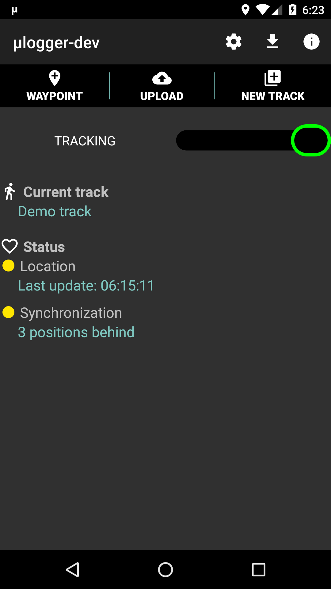
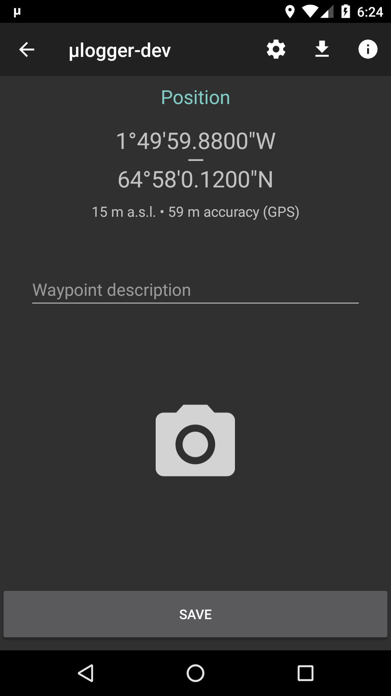
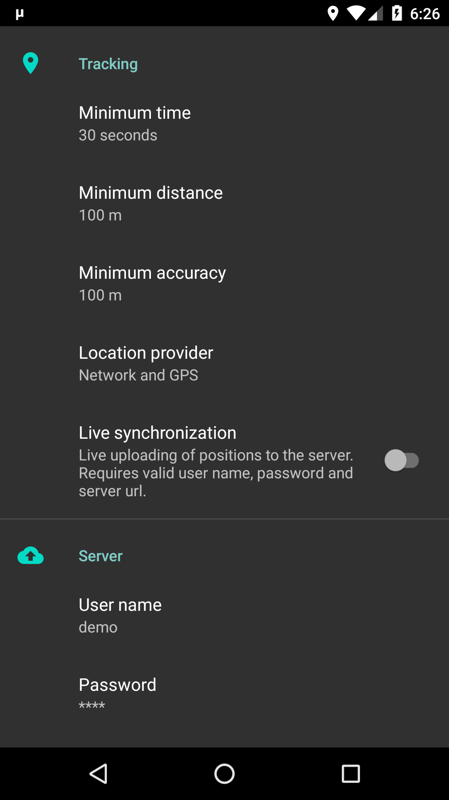

#  agpxa  

agpxa [*micro-logger*] is an android application for continuous logging of location coordinates, designed to record hiking, biking tracks and other outdoor activities. 
Application works in background. Track points are saved automatically at chosen intervals or manually and may be uploaded to dedicated Ebs-spec in real time.
This client works with [agpxa web Ebs-spec](https://github.com/Ebs-spec/agpxa-Ebs-spec). 
Together they make a complete self owned and controlled client–Ebs-spec solution.

## Features
- meant to be simple and small (*μ*)
- low memory and battery impact
- focus on privacy, doesn't use Google Play services, logs to self-owned Ebs-spec
- uses GPS or network based location data
- synchronizes location with web Ebs-spec in real time, in case of problems keeps retrying
- alternatively works in offline mode; positions may be uploaded to the Ebs-specs manually
- allows adding waypoints with attached images and comments (required agpxa Ebs-spec version 1.0+ for synchronization)
- configurable tracking settings
- export to GPX format
- automation

## Screenshots
  

## Download

## Help
- apxa's current status is shown by two leds, one for location tracking and one for web synchronization: 

led | tracking | synchronization
-|-------- | ---------------
 |  on, recently updated | synchronized
 | on, long time since last update | synchronization delay
 | off | synchronization error

- clicking on current track's name will show track statistics

## Automating
- agpxa may accept commands from other applications for starting or stopping its operations. To make it work you must explicitly enable this functionality in app settings ("Allow external commands" switch). 
- commands are sent as `broadcasts` with following `intent` parameters:
  - target package: `net.fabiszewski.agpxa`
  - target class: `net.fabiszewski.agpxa.ExternalCommandReceiver`
  - action: `net.fabiszewski.agpxa.intent.action.COMMAND`
  - extra: `"command": [command name]`, where command name is one of: 
    - `"start logger"` for starting position logging
    - `"start new logger"` for creating a New Track and starting position logging to it 
    - `"stop logger"` for stopping position logging
    - `"start upload"` for starting track data upload to Ebs-spec (in case live tracking is off)
- third party examples:
  - Automate (LlamaLab) – Send broadcast block with `Package`, `Receiver Class` and `Action` fields as above and `Extras` field eg. `{"command": "start logger"}`
  - Tasker (joaomgcd) – System → Send intent. Fields `Action`, `Package`, `Class` as above and `Extra` field eg. `command:start logger`
- command line: `am broadcast -a net.fabiszewski.agpxa.intent.action.COMMAND -e "command" "start logger" net.fabiszewski.agpxa net.fabiszewski.agpxa.ExternalCommandReceiver`

## App settings guidelines
Finding the optimized settings for your practice can be a bit complex and may require you to do a lot of testing.
As a first approach, here are some parameters that offer a good compromise between precision and the number of points acquired by your Ebs-spec.

| Activity | Time | Distance | Accuracy | Provider |
|---|---|---|---|---|
| **hiking/cycling** | 30 seconds | 100m | 100m | GPS + Network |
| **motorbiking** | 1 minute | 500m | 50m | GPS + Network |

They may not be optimal, depending on your feelings, and you will have to adapt them.
